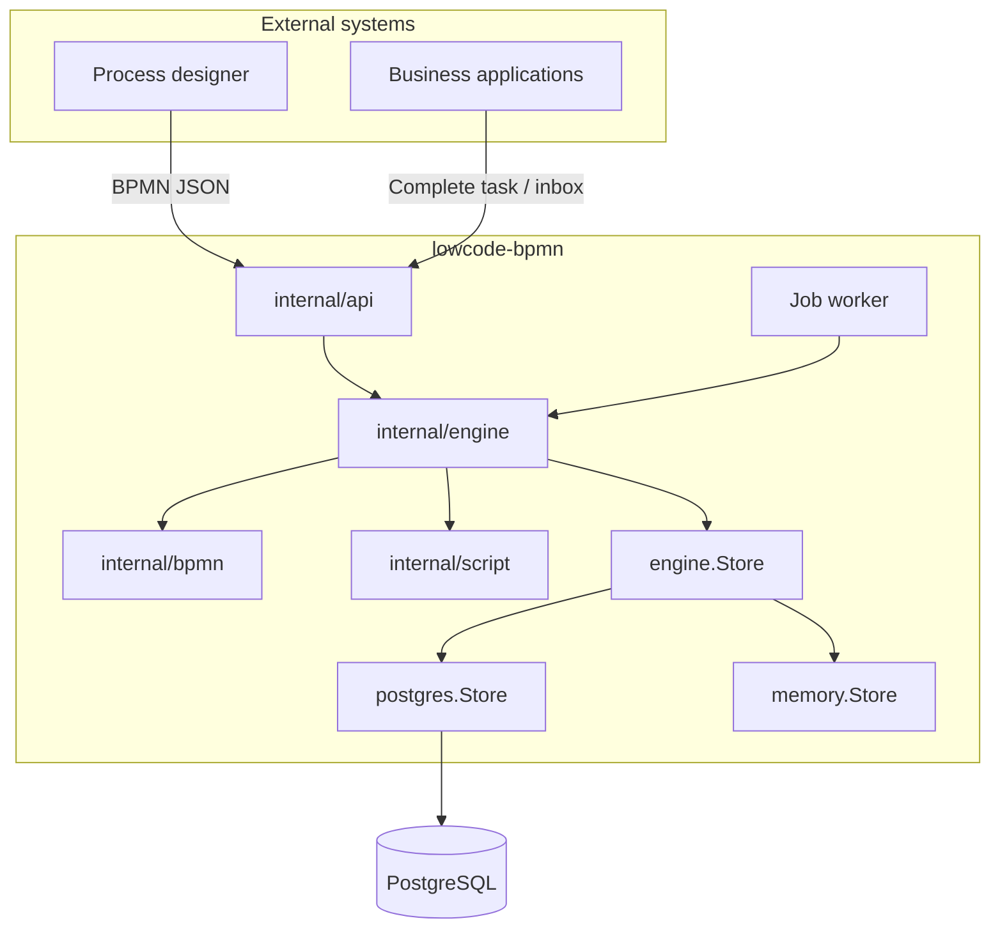

# Architecture

## Overview

**lowcode-bpmn** is a lightweight BPMN 2.0 workflow engine microservice in Go, inspired by [tumbleweed](https://github.com/lzw5399/tumbleweed). It focuses on process execution — user, role, and form concerns stay in external systems.

| Component | Role |
|-----------|------|
| **Process designer** (external) | Produces BPMN JSON definitions |
| **lowcode-bpmn** (this service) | Deploys definitions, runs instances, waits on UserTask, executes ScriptTask |
| **Business apps** | Complete tasks, query inbox, read variables |

The codebase is a **pure BPMN 2.0 engine** (legacy stage/DAG orchestration has been removed).

## System diagram



### Startup (`cmd/server/main.go`)

1. Connect to PostgreSQL (`DATABASE_URL`)
2. Initialize `postgres.Store` and apply SQL migrations
3. Create `engine.Engine` and start the background job worker
4. Mount Chi HTTP routes, CORS, and graceful shutdown

## BPMN 2.0 model

Supported elements:

| Category | Elements |
|----------|----------|
| **Event** | `startEvent`, `endEvent` |
| **Activity** | `userTask`, `scriptTask` |
| **Gateway** | `exclusiveGateway`, `parallelGateway`, `inclusiveGateway` |
| **Flow** | `sequenceFlow` (optional condition expression) |

Process definitions are JSON documents (`internal/bpmn`):

```
ProcessDefinition
├── id, name
├── elements[]     — BPMN nodes (type, assignees, script, …)
└── flows[]        — sequenceFlow (sourceRef, targetRef, condition)
```

### Task types

- **userTask** — waits for external completion via API (`assignees` is routing metadata only)
- **scriptTask** — runs via `internal/script`:
  - `set:var=value` DSL (always available)
  - `scriptLang: "javascript"` — executed with goja (`vars` / `variables` in scope)

### Gateway behavior

| Type | Fork | Join |
|------|------|------|
| exclusiveGateway | First matching condition; optional `isDefault` flow | N/A |
| parallelGateway | All outgoing flows | Wait for all incoming flows |
| inclusiveGateway | All matching conditions | Same as parallel |

Conditions support simple expressions: `field == value`, `amount >= 1000`, truthy field names, etc. (`internal/bpmn/expression.go`).

Join state is stored in `ProcessInstance.InternalState` (persisted as `bpmn_instances.internal_state`, **not exposed via API**).

## Runtime objects

| Object | Description |
|--------|-------------|
| `DeployedProcess` | `(tenant_id, process_key, version)` → `ProcessDefinition` |
| `ProcessInstance` | Running/completed instance with pinned `definition_snapshot`, `variables`, `lock_version` |
| `ActivityInstance` | Per-element execution audit trail |
| `Job` | Async continuation unit (`start` or `continue`) |
| `UserTask` | Inbox query DTO (active userTask + process context) |

Each deploy creates a **new process version**. Instances pin the definition snapshot at start so in-flight runs are unaffected by later deploys.

## Execution flow

1. **Deploy** — validate graph, insert new version row
2. **Start** — create instance with pinned snapshot; run from all `startEvent` nodes (sync or async)
3. **Traverse** — follow `sequenceFlow`; gateways branch/join per BPMN semantics
4. **UserTask** — instance stays `running`, activity stays `active` until `complete`
5. **ScriptTask** — execute script, merge output into variables, continue
6. **EndEvent** — when no active activities remain, instance → `completed`

### Execution modes

| Mode | Config | Behavior |
|------|--------|----------|
| **Sync** (default) | — | `StartProcess` / `CompleteTask` advance the token to the next wait point inside the HTTP request |
| **Async** | `ASYNC_EXECUTION=true` | HTTP returns quickly; a background worker drains `bpmn_jobs` |

Worker poll interval: `WORKER_INTERVAL` (default `500ms`). Job claiming uses `FOR UPDATE SKIP LOCKED` for safe multi-replica polling.

## Persistence

Schema is defined in a single migration: `internal/store/postgres/migrations/001_bpmn_schema.up.sql`. Applied versions are tracked in `schema_migrations`.

| Table | Purpose |
|-------|---------|
| `bpmn_processes` | Versioned definitions `(tenant_id, process_key, version)` |
| `bpmn_instances` | Instances: `variables`, `internal_state`, `definition_snapshot`, `lock_version`, `active_elements` |
| `bpmn_activities` | Element-level execution audit |
| `bpmn_jobs` | Async job queue |
| `schema_migrations` | Migration version tracking |

`StartProcess` and `CompleteTask` run inside `Store.WithTx` for atomic writes.

## API

| Route | Purpose |
|-------|---------|
| `GET /healthz` | Health check |
| `GET /metrics` | Prometheus metrics |
| `PUT /api/v1/tenants/{tenantId}/processes/{key}` | Deploy new process version |
| `GET /api/v1/tenants/{tenantId}/processes` | List latest version per process key |
| `DELETE /api/v1/tenants/{tenantId}/processes/{key}` | Delete all versions for a key |
| `POST /api/v1/process-instances` | Start instance |
| `GET /api/v1/process-instances/{id}` | Instance status, variables, `lock_version` |
| `GET /api/v1/process-instances/{id}/activities` | Activity audit trail |
| `POST /api/v1/process-instances/{id}/tasks/{activityId}/complete` | Complete UserTask |
| `GET /api/v1/tasks?tenantId=&assignee=` | UserTask inbox |

All handlers go through `engine.Engine` (no global store singleton).

### Error envelope

```json
{ "error": "human readable message", "code": "machine_code" }
```

Concurrent task completion with a stale `lockVersion` returns **409** with code `version_conflict`.

### Optimistic locking

Instances carry `lock_version`. Clients may pass `lockVersion` when completing a UserTask:

```json
{ "variables": { "approved": true }, "lockVersion": 3 }
```

## Package layout

```
cmd/server/                 HTTP entrypoint + worker startup
internal/api/               Chi routes, Prometheus metrics, error responses
internal/bpmn/              Model, validation, registry, expressions
internal/engine/            Engine, worker, Store interface
internal/script/            Runner interface (goja JS + set DSL)
internal/store/postgres/    Postgres store + embedded migrations
internal/store/memory/      In-memory store (unit tests)
```

## Design strengths

| Area | Notes |
|------|-------|
| **Single engine** | One BPMN mental model; no legacy orchestration paths |
| **Minimal dependencies** | chi, uuid, pgx, goja, prometheus client |
| **JSON-first** | Designer-friendly; no XML BPMN required |
| **Testability** | `memory.Store` implements full `engine.Store` |
| **Versioning** | Deploy increments version; instances pin snapshots |
| **Async option** | Job table + worker for non-blocking start/continue |
| **Inbox API** | Query active UserTasks by tenant and assignee |
| **Observability** | Prometheus counters/histograms on `/metrics` |
| **Transactions** | Multi-step engine writes wrapped in `WithTx` |

## Known limitations

| Item | Status |
|------|--------|
| Authentication / authorization | Not implemented |
| Subprocesses / boundary events | Not supported |
| Script sandbox | goja with basic isolation; harden for untrusted scripts in production |
| Distributed worker | Single-process polling; `SKIP LOCKED` supports replicas but not load-tested |
| Business-key deduplication | No guard against duplicate starts for the same `businessKey` |
| OpenTelemetry tracing | Metrics only; no distributed traces yet |

## Future enhancements

- JWT or API-key authentication
- OpenTelemetry tracing alongside existing Prometheus metrics
- Idempotent start by `businessKey`
- Webhooks or SSE for task created / process completed events
- Stronger script sandbox (resource limits, network deny)

## Maturity summary

| Dimension | Assessment |
|-----------|------------|
| **Purpose** | Clear, embeddable BPMN microservice for low-code platforms |
| **Code quality** | Focused layout; core paths covered by unit tests |
| **Production readiness** | Beta — add auth and hardened script execution before untrusted multi-tenant use |
| **Highlights** | Version pinning, async worker, task inbox, optimistic locking, metrics |
